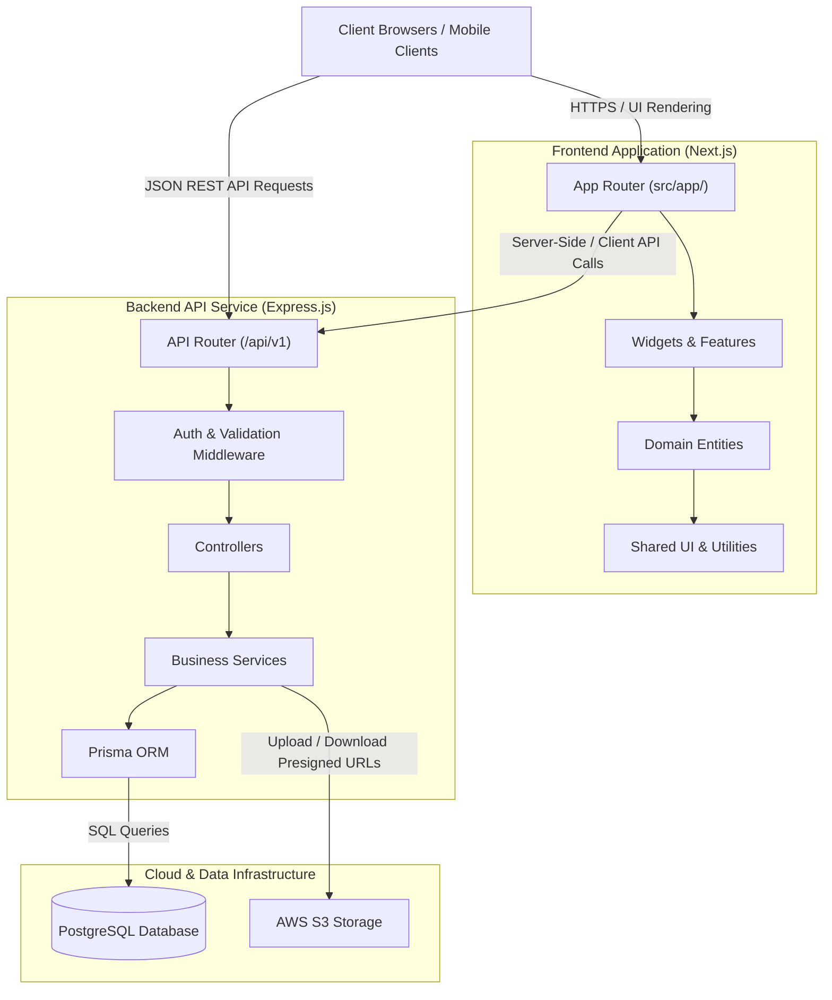
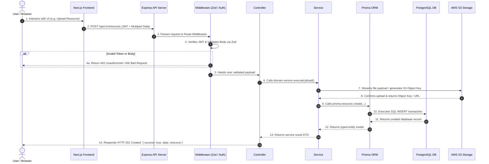
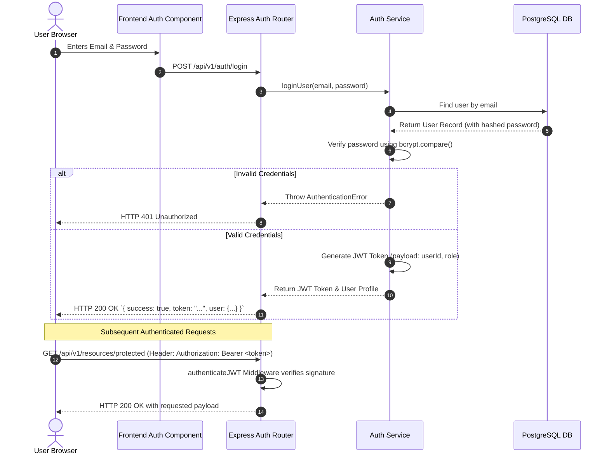
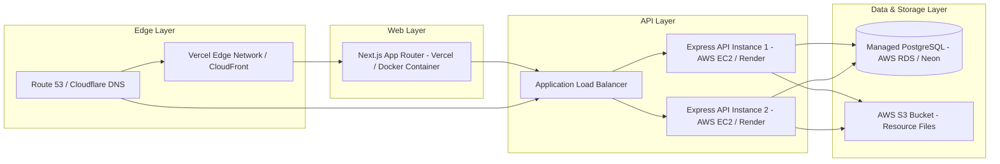

# Architecture Specification - Student Hub

This document defines the high-level **system architecture**, **frontend folder structure**, and **integration contracts** for Student Hub.

Student Hub uses a **decoupled application architecture** separating the **Frontend User Interface** (Next.js) from the **Core Backend Service** (Express.js REST API).

---

## 1. Overall System Architecture

Student Hub is structured as two independent, decoupled services that communicate via a structured **RESTful HTTP API**:



### Architectural Principles

1. **Strict Decoupling**: The frontend application (`Next.js`) serves UI and handles user interaction. The backend service (`Express.js`) enforces business logic, data validation, authentication, and database/storage access.
2. **Stateless Backend API**: The backend holds no session state. All requests are authenticated via **JWT (JSON Web Tokens)** sent in the `Authorization: Bearer <token>` header.
3. **Layered Isolation**: Code within both applications follows strict unidirectional dependency flows to prevent circular imports and maintain clear boundaries.

---

## 2. Frontend Architecture (Feature-Sliced Design)

The frontend application remains located in `src/` and adheres to **Feature-Sliced Design (FSD)** principles adapted for Next.js App Router.

### Import Direction Rules

```
src/app → widgets, features, entities, shared
widgets → features, entities, shared
features → entities, shared
entities → shared
shared → (no upward imports)
```

### Layer Reference

#### `src/app/`
- **What**: Next.js App Router — `layout.tsx`, `page.tsx`, route segments, global CSS.
- **Why**: Framework-mandated routing, SSR entry points, and document shell.
- **Rule**: Pages should compose widgets and features, not implement business rules inline.

#### `src/features/`
- **What**: User-facing action-oriented capabilities.
- **Modules**: `browse/` (catalog navigation), `search/` (query UI & filtering), `upload/` (resource submission workflow), `auth/` (login/register forms).
- **Why**: Keeps user flows modular and independently testable.

#### `src/entities/`
- **What**: Domain models and entity-specific UI blocks (e.g., `Course`, `Resource`, `Program`, `User`).
- **Why**: Centralizes shared domain nouns and components like `ResourceCard` or `UserAvatar`.

#### `src/widgets/`
- **What**: Composed structural UI regions — `Navbar`, `Footer`, `HeroSection`, `Sidebar`.
- **Why**: Orchestrates features and entities into coherent layout blocks.

#### `src/shared/`
- **What**: Reusable, feature-agnostic primitives and utilities.
- **Subfolders**: `components/` (Button, Input, Card), `constants/`, `config/`, `lib/` (API client, fetch wrappers), `hooks/`, `types/`.

---

## 3. Backend Architecture Reference

The backend operates as an independent **Express.js + TypeScript** application.

> [!NOTE]
> For comprehensive details on the backend architecture, request lifecycles, database schemas, ADRs, and folder structure, refer to the dedicated single source of truth document:
> **[docs/backend-architecture.md](./docs/backend-architecture.md)**

### Backend Layer Responsibilities Summary

```
HTTP Request ➔ Route ➔ Middleware ➔ Controller ➔ Service ➔ Prisma ORM ➔ PostgreSQL
```

- **Routes (`src/routes/`)**: Map REST endpoints to controller actions.
- **Middleware (`src/middleware/`)**: Validate Zod schemas, verify JWT tokens, handle CORS, log HTTP requests.
- **Controllers (`src/controllers/`)**: Parse HTTP parameters, invoke domain services, format JSON HTTP responses.
- **Services (`src/services/`)**: Enforce business rules, process data, orchestrate AWS S3 uploads, coordinate database transactions.
- **Prisma Layer (`src/prisma/` / `src/lib/prisma.ts`)**: Type-safe query engine for PostgreSQL.

---

## 4. Overall Project Folder Structure

```
student-hub/
├── ARCHITECTURE.md                  # High-level system architecture (This document)
├── README.md                        # Project setup & quickstart guide
├── PROJECT_HISTORY.md               # Historical installation & environment records
├── JARVIS_PROTOCOL.md               # AI execution & engineering rules
├── docs/
│   └── backend-architecture.md      # Comprehensive single source of truth for Express Backend
├── public/                          # Static public web assets
├── src/                             # Next.js Frontend Application (FSD)
│   ├── app/                         # App Router pages and layouts
│   ├── widgets/                     # Composed layout sections (Navbar, Hero, Footer)
│   ├── features/                    # Action features (browse, search, upload, auth)
│   ├── entities/                    # Domain entities (Resource, Course, Program, User)
│   └── shared/                      # Reusable UI components, hooks, API client wrappers
└── backend/                         # Express Backend Application Workspace (or standalone repo)
    ├── prisma/                      # Database schema & migration files
    ├── src/
    │   ├── config/                  # Environment variables & AWS/DB configurations
    │   ├── controllers/             # HTTP Request/Response handlers
    │   ├── lib/                     # Singleton SDK instances (Prisma, S3 client)
    │   ├── middleware/              # JWT auth, error handling, rate limiting
    │   ├── routes/                  # Express API route declarations
    │   ├── services/                # Core domain business logic
    │   ├── types/                   # Backend TypeScript interfaces & DTOs
    │   ├── utils/                   # Helper functions & custom AppError classes
    │   ├── validators/              # Zod validation schemas
    │   └── server.ts                # Express application entry point
    ├── tsconfig.json                # Backend TypeScript configuration
    └── package.json                 # Backend dependencies (Express, Prisma, AWS SDK, etc.)
```

---

## 5. System Request & Data Flow

### Comprehensive End-to-End Request Flow



---

## 6. Authentication & Authorization Flow

Student Hub uses a **Stateless JWT (JSON Web Token)** architecture with **bcrypt** password hashing:



---

## 7. Deployment Architecture



- **Frontend Deployment**: Hosted on Vercel or containerized via Docker for optimized SSR/SSG page delivery and global CDN distribution.
- **Backend API Deployment**: Hosted on Node.js application platforms (AWS EC2, AWS ECS, or Render) behind a load balancer to support horizontal autoscaling.
- **Database Infrastructure**: Managed PostgreSQL database (AWS RDS or Neon) with connection pooling enabled.
- **Object Storage**: AWS S3 Bucket configured with CORS and strict IAM access controls for raw resource uploads and presigned download links.

---

## 8. Data Flow Matrix

| Flow Type | Initiator | Transport | Target Layer | Storage Layer |
|-----------|-----------|-----------|--------------|---------------|
| **Catalog Browse** | Client / Server Component | HTTP GET | Express `ResourceController` | PostgreSQL via Prisma |
| **Full-Text Search** | Search Bar UI | HTTP GET | Express `SearchController` | PostgreSQL Index / Search Service |
| **Document Upload** | Upload Form | Multipart HTTP POST | Express `UploadController` + `StorageService` | AWS S3 Bucket + Metadata in Postgres |
| **Auth Session** | Login / Register UI | HTTP POST | Express `AuthController` | JWT Client-side Store / Memory |

---

## 9. Future Architecture Notes

1. **Backend Documentation**: Refer to **[docs/backend-architecture.md](./docs/backend-architecture.md)** for exhaustive details on backend design decisions, ORM schemas, ADRs, and layer-by-layer specs.
2. **Caching & Performance**: Future integration of **Redis** for token blacklisting, rate limiting, and HTTP response caching.
3. **Asynchronous Jobs**: Integration of **BullMQ** for background PDF indexing, thumbnail generation, and automated virus scanning.
4. **Mobile Client Integration**: Because the backend is fully decoupled and RESTful, mobile clients (iOS / Android / React Native) can directly consume the Express REST API without modifying core backend code.

---

## Related Documents

- **[docs/backend-architecture.md](./docs/backend-architecture.md)** — Express Backend Single Source of Truth
- **[README.md](./README.md)** — Project overview and setup instructions
- **[PROJECT_HISTORY.md](./PROJECT_HISTORY.md)** — Environment setup and library installation history
- **[JARVIS_PROTOCOL.md](./JARVIS_PROTOCOL.md)** — Operational and safety protocols
