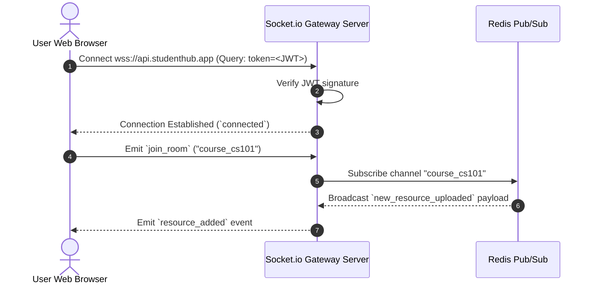

# Future API Roadmap & Integration Specification - Student Hub

> **Document Status**: Draft / Roadmap  
> **Target Version**: `v2` (Phase 2 & 3 Expansion)  
> **Last Updated**: 2026-07-29  

---

## 1. Overview

This document outlines future REST API endpoints, WebSockets channels, and GraphQL gateway concepts planned for subsequent development phases of Student Hub.

---

## 2. Resource Comments & Discussion API (Phase 2)

| Method | Path | Auth Required | Description |
|--------|------|---------------|-------------|
| `GET` | `/api/v1/resources/:id/comments` | No | Fetch threaded comments for a resource |
| `POST` | `/api/v1/resources/:id/comments` | Yes (Bearer) | Post a comment or question on a resource |
| `DELETE` | `/api/v1/comments/:id` | Yes (Bearer) | Delete user's own comment |

---

## 3. Ratings & Peer Reviews API (Phase 2)

| Method | Path | Auth Required | Description |
|--------|------|---------------|-------------|
| `POST` | `/api/v1/resources/:id/ratings` | Yes (Bearer) | Submit or update 1-5 star rating and review |
| `GET` | `/api/v1/resources/:id/ratings` | No | Get rating distribution metrics for a resource |

---

## 4. Real-Time WebSockets Protocol (Phase 3)

For real-time collaborative study groups and instant upload status updates, a **WebSocket server (Socket.io)** will connect at `wss://api.studenthub.app/socket.io`.

### WebSocket Events Spectrum



---

## 5. GraphQL Gateway Protocol (Phase 4 Evaluation)

To reduce over-fetching on mobile applications, a GraphQL gateway may be introduced at `/graphql`:

```graphql
type Resource {
  id: ID!
  title: String!
  description: String
  fileUrl: String!
  course: Course!
  author: User!
  ratings: [Rating!]!
}

type Query {
  resource(id: ID!): Resource
  searchResources(query: String!): [Resource!]!
}
```

---

## Document Cross-References

- **[api-design.md](./api-design.md)** — Core API design standards
- **[../roadmap/roadmap.md](../roadmap/roadmap.md)** — Project phase roadmap
