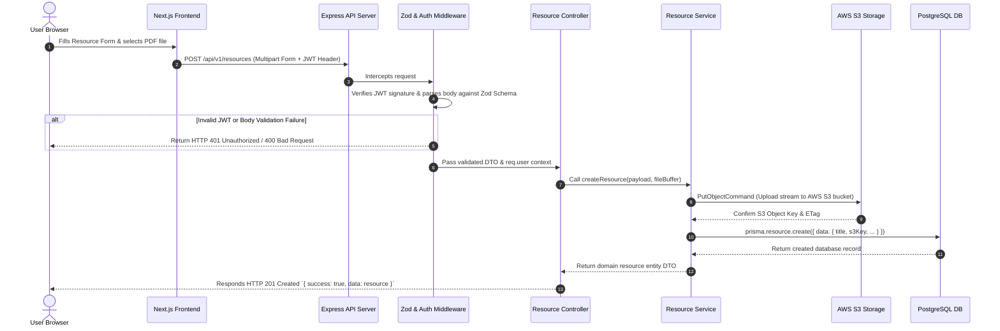

# System Architecture Specification - Student Hub

> **Document Status**: Active / Authoritative  
> **Target Audience**: Software Engineers, System Architects, DevOps  
> **Last Updated**: 2026-07-29  

---

## 1. Executive Summary & Topology

Student Hub is designed as a **decoupled, multi-tier web application**. The system separates user interface rendering (handled by a **Next.js App Router** frontend) from core business logic execution, data persistence, and cloud file management (handled by a standalone **Express.js + TypeScript** REST API service).

```mermaid
graph TD
    Client["User Browsers & Mobile Clients"]

    subgraph Frontend Tier ["Frontend Service (Next.js 14+)"]
        NextApp["App Router (src/app)"]
        FSDWidgets["Widgets & Layout Blocks"]
        FSDFeatures["Action Features (Browse, Search, Upload)"]
        FSDEntities["Domain Entities (Resource, Course, User)"]
        SharedClient["Shared API Client Wrapper"]
    end

    subgraph Backend Tier ["Backend API Service (Express.js)"]
        Router["REST Router (/api/v1)"]
        AuthMW["JWT & Zod Middleware Layer"]
        Controllers["Controller Layer"]
        Services["Domain Business Logic Services"]
        PrismaORM["Prisma Data Mapper"]
    end

    subgraph Infrastructure Tier ["Cloud Infrastructure"]
        PostgreSQL[(PostgreSQL Relational DB)]
        S3Storage[AWS S3 Bucket (Documents & PDFs)]
    end

    Client -->|HTTPS Page Load| NextApp
    NextApp --> FSDWidgets
    FSDWidgets --> FSDFeatures
    FSDFeatures --> FSDEntities
    FSDEntities --> SharedClient

    Client -->|JSON REST API Requests| Router
    SharedClient -->|HTTPS REST Calls| Router

    Router --> AuthMW
    AuthMW --> Controllers
    Controllers --> Services
    Services --> PrismaORM
    Services -->|Presigned Uploads & Downloads| S3Storage
    PrismaORM -->|SQL Queries via Connection Pool| PostgreSQL
```

---

## 2. Core Subsystems

### 2.1 Web Frontend Subsystem (Next.js App Router)
- **Framework**: Next.js (React, TypeScript, Tailwind CSS).
- **Architecture**: Feature-Sliced Design (FSD).
- **Primary Ownership**: User interface, accessibility, search filter state, responsive design, component composition, and SEO page rendering.
- **Data Fetching Strategy**: Server Components (RSC) fetch public catalog pages via server-side HTTP calls to the backend API; interactive forms (Upload, Auth) issue client-side fetch requests using a centralized API client wrapper.

### 2.2 Core API Subsystem (Express.js REST API)
- **Runtime & Framework**: Node.js + Express.js + TypeScript.
- **Primary Ownership**: Authentication processing, password hashing (`bcrypt`), Zod schema validation, business workflow execution, database access via Prisma, and object storage orchestration.
- **State Model**: 100% Stateless. Session state is represented via JWT Bearer Tokens carried in the `Authorization` request header.

### 2.3 Relational Storage Subsystem (PostgreSQL + Prisma)
- **Database Engine**: PostgreSQL.
- **ORM / Mapper**: Prisma ORM.
- **Primary Ownership**: Relational model storage for users, academic programs, courses, resource metadata, ratings, categories, and tags. ACID transaction enforcement.

### 2.4 Cloud Object Storage Subsystem (AWS S3)
- **Service**: AWS Simple Storage Service (S3).
- **Primary Ownership**: Immutable binary storage for uploaded academic PDF notes, syllabus files, and documents. Access controlled via AWS IAM policies and presigned S3 URLs.

---

## 3. High-Level C4 System Context Diagram

```mermaid
C4Context
    title System Context Diagram for Student Hub

    Person(student, "Student / User", "Browses catalog, searches notes, uploads academic documents.")
    System(studentHub, "Student Hub Platform", "Decoupled Web Application & REST API providing academic resource discovery.")
    SystemDb(postgres, "PostgreSQL Database", "Stores relational metadata, course information, and user profiles.")
    SystemExt(awsS3, "AWS S3 Storage", "Hosts raw uploaded PDF files, images, and document binaries.")

    Rel(student, studentHub, "Uses UI & consumes REST API", "HTTPS / JSON")
    Rel(studentHub, postgres, "Reads & writes relational records", "Prisma / SQL")
    Rel(studentHub, awsS3, "Streams file uploads & generates presigned URLs", "AWS SDK v3")
```

---

## 4. End-to-End System Sequence Diagram

The following diagram illustrates a complete user request lifecycle for uploading an academic resource:



---

## 5. Security & Isolation Boundaries

1. **Network Boundary**: Public users access the frontend via HTTPS CDN edge servers. The backend API is exposed under `/api/v1/*` behind an Application Load Balancer enforcing CORS restrictively.
2. **Credential Boundary**: Backend secrets (`DATABASE_URL`, `JWT_SECRET`, `AWS_SECRET_ACCESS_KEY`) are injected into Node environment variables at runtime and never exposed to the frontend bundle.
3. **Data Access Boundary**: Frontend code never connects to PostgreSQL directly. All data access must pass through validated Express REST controllers.

---

## 6. Document Cross-References

- **[frontend-architecture.md](./frontend-architecture.md)** — Detailed FSD Next.js frontend specification
- **[backend-architecture.md](./backend-architecture.md)** — Exhaustive Express REST API backend reference
- **[database-architecture.md](./database-architecture.md)** — PostgreSQL & Prisma data layer specification
- **[deployment-architecture.md](./deployment-architecture.md)** — Cloud deployment infrastructure topology
