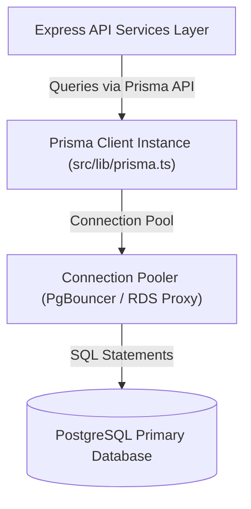

# Database Architecture Specification - Student Hub

> **Document Status**: Active / Authoritative  
> **Database Engine**: PostgreSQL 16+  
> **Object Mapper**: Prisma ORM  
> **Last Updated**: 2026-07-29  

---

## 1. Overview & Data Storage Strategy

Student Hub relies on **PostgreSQL** as its primary relational database. PostgreSQL was selected for its strict ACID guarantees, strong multi-table relational performance, native Full-Text Search (FTS) capabilities, and JSONB document support for flexible resource metadata.

Data access is managed through **Prisma ORM**, providing compile-time type safety, automated migrations, and connection management.



---

## 2. Core Relational Models Summary

```
User (1) ────< (N) Resource (N) >──── (1) Course (N) >──── (1) Program
  │                 │
  └────< (N) Rating  └────< (N) ResourceTag >──── (1) Tag
```

1. **User**: Represents registered students, contributors, and platform administrators. Holds hashed passwords (`bcrypt`) and role definitions (`STUDENT`, `CONTRIBUTOR`, `ADMIN`).
2. **Program**: Represents academic majors and degree programs (e.g., Computer Science, Electrical Engineering).
3. **Course**: Represents specific academic courses belonging to a Program (e.g., CS101, Data Structures).
4. **Resource**: Represents uploaded academic documents (notes, textbooks, past papers). Holds AWS S3 object keys and metadata.
5. **Rating**: Captures student ratings (1 to 5 stars) and reviews for resources.
6. **Tag & ResourceTag**: Enables multi-tag categorization (e.g., `#midterm`, `#lab-report`, `#cheatsheet`).

---

## 3. Database Connection & Performance Architecture

### 3.1 Connection Pooling
- Prisma Client maintains an internal connection pool configured via the database connection string parameters (`connection_limit=10&pool_timeout=30`).
- For serverless or high-concurrency production deployments, PgBouncer or AWS RDS Proxy is placed between Prisma and PostgreSQL to prevent connection exhaustion.

### 3.2 Indexing Strategy
To maintain sub-50ms query response times under scale, composite and specialized indexes are applied:
- **Primary Keys**: B-Tree indexes automatically created on all `id` (UUID / CUID) columns.
- **Foreign Key Indexes**: Applied to `authorId`, `courseId`, `programId` to optimize relational JOIN performance.
- **Search Indexes**: PostgreSQL GIN (Generalized Inverted Index) applied to `title` and `description` vector columns for fast full-text academic searching.
- **Unique Indexes**: Applied to `User.email` and `Program.code`.

---

## 4. Document Cross-References

- **[../database/erd.md](../database/erd.md)** — Complete Mermaid Entity Relationship Diagram
- **[../database/schema.md](../database/schema.md)** — Comprehensive schema field data dictionary
- **[../database/migrations.md](../database/migrations.md)** — Zero-downtime migration procedures
