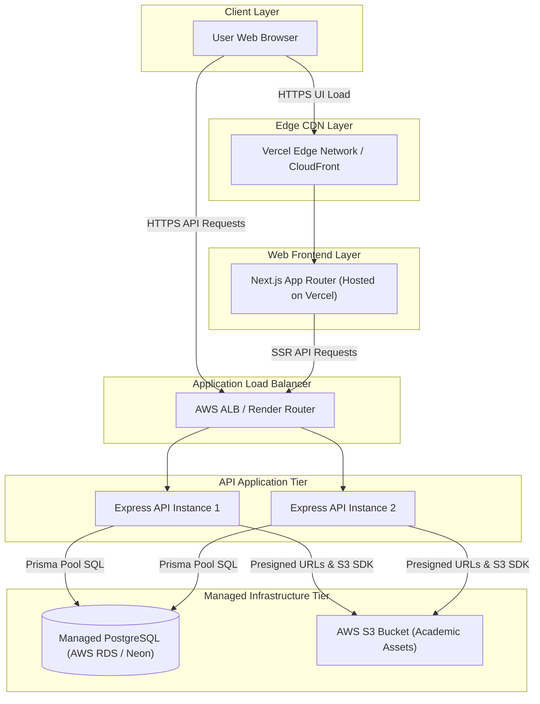

# Deployment Infrastructure Architecture - Student Hub

> **Document Status**: Active / Authoritative  
> **Environment**: Multi-Tier Cloud Deployment  
> **Target Cloud Providers**: Vercel (Frontend Edge), Render / AWS EC2 (Backend API), AWS S3 (Storage), Managed PostgreSQL (Database)  
> **Last Updated**: 2026-07-29  

---

## 1. Overview & Cloud Topology

Student Hub is deployed across specialized cloud infrastructure providers to optimize performance, cost efficiency, global CDN distribution, and independent scalability.

---

## 2. Environment Configuration Matrix

| Environment | Frontend Deployment | Backend API Deployment | Database | Storage |
|-------------|---------------------|------------------------|----------|---------|
| **Local Dev** | `http://localhost:3000` | `http://localhost:5000` | Local Docker Postgres | Local S3 / AWS S3 Dev Bucket |
| **Staging** | Vercel Preview Deployment | Render Staging Service | Neon Staging Branch | AWS S3 Staging Bucket |
| **Production** | Vercel Production Domain | Render / AWS EC2 Auto-Scaling Group | Managed RDS Postgres | AWS S3 Production Bucket |

---

## 3. SSL/TLS, CORS & Security Boundaries

1. **HTTPS Enforcement**: All incoming traffic is forced to HTTPS via TLS 1.3 encryption.
2. **CORS Policy**: The Express backend restricts `Access-Control-Allow-Origin` strictly to the verified frontend domain (`https://studenthub.app`).
3. **Environment Secret Management**: Secrets (`DATABASE_URL`, `JWT_SECRET`, `AWS_SECRET_ACCESS_KEY`) are managed using platform environment variable stores (Vercel Environment Variables, Render Secret Manager, or AWS Secrets Manager). Secrets are NEVER committed to source control.

---

## 4. Document Cross-References

- **[architecture.md](./architecture.md)** — High-level system architecture
- **[../setup/deployment-guide.md](../setup/deployment-guide.md)** — Step-by-step production deployment manual
