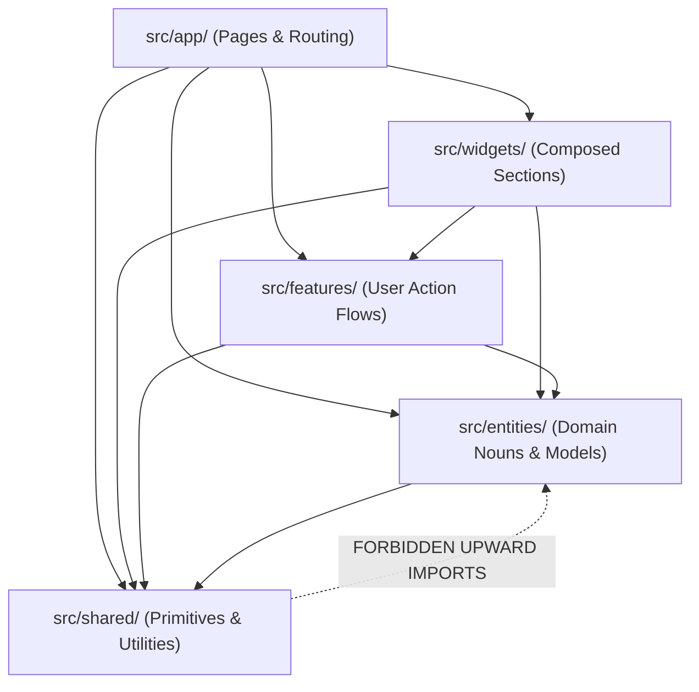
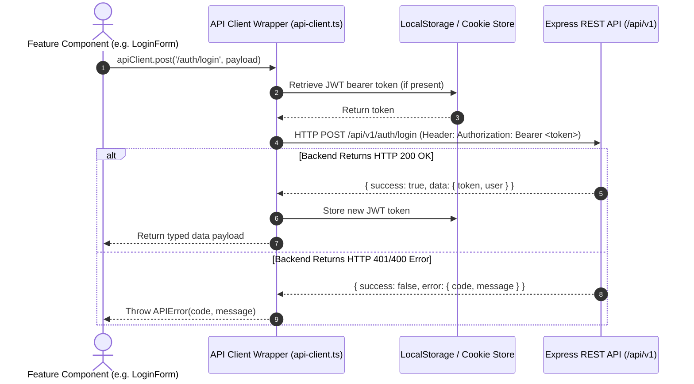

# Frontend Architecture Specification - Student Hub

> **Document Status**: Active / Authoritative  
> **Framework**: Next.js App Router (React, TypeScript, Tailwind CSS)  
> **Design Methodology**: Feature-Sliced Design (FSD)  
> **Last Updated**: 2026-07-29  

---

## 1. Overview & Architectural Methodology

The Student Hub frontend is built using **Next.js (App Router)**, **React**, **TypeScript**, and **Tailwind CSS**. 

To prevent the common problem of Next.js projects devolving into flat, unmaintainable directories of mixed components, Student Hub strictly enforces a modified version of **Feature-Sliced Design (FSD)** adapted for Next.js App Router file-system routing conventions.

```
src/
├── app/         # Next.js App Router (Routing entrypoints & document shells)
├── widgets/     # Large composed page regions (Navbar, Hero, Footer, Sidebar)
├── features/    # Action-oriented user flows (browse, search, upload, auth)
├── entities/    # Core domain models & entity UI (Course, Resource, User, Program)
└── shared/      # Feature-agnostic primitives (UI components, hooks, API client)
```

---

## 2. Layer Definitions & Rules



### Strict Import Direction Rule
> **Layer Rule**: Code in a given layer may ONLY import from layers below it. Cross-imports within the same layer are restricted to subfolder boundaries. Upward imports are strictly prohibited and enforced via ESLint rules.

---

## 3. Detailed Layer Breakdown

### 3.1 `src/app/` (Routing Layer)
- **Responsibility**: Houses Next.js App Router segments (`layout.tsx`, `page.tsx`, `error.tsx`, `loading.tsx`, `providers.tsx`).
- **Rule**: Page files in `src/app/` must be light composition wrappers. They assemble widgets and features into page layouts and MUST NOT contain inline business logic, direct fetch statements, or heavy state manipulation.

### 3.2 `src/widgets/` (Composed Section Layer)
- **Responsibility**: Structural page regions used across multiple views (e.g., `Navbar`, `Footer`, `HeroSection`, `SidebarNavigation`).
- **Composition**: Widgets assemble features and entity components into unified UI sections without owning specific domain action logic.

### 3.3 `src/features/` (User Action Layer)
- **Responsibility**: Functional capabilities grouped by user action goals.
- **Modules**:
  - `features/browse/`: Program catalog filters, department selection, and grid presentation.
  - `features/search/`: Global search bar, query debouncing, multi-criteria filter controls.
  - `features/upload/`: Resource submission modal, drag-and-drop file stream handling, metadata tagging.
  - `features/auth/`: Login form, registration wizard, password validation UI.

### 3.4 `src/entities/` (Domain Model Layer)
- **Responsibility**: UI representations and data structures for core business nouns.
- **Modules**:
  - `entities/resource/`: `ResourceCard`, `ResourcePreview`, `ResourceBadge`, `resource.types.ts`.
  - `entities/course/`: `CourseCard`, `CourseHeader`, `course.types.ts`.
  - `entities/user/`: `UserAvatar`, `UserProfileHeader`, `user.types.ts`.
  - `entities/program/`: `ProgramCard`, `program.types.ts`.

### 3.5 `src/shared/` (Infrastructure & Primitives Layer)
- **Responsibility**: Cross-cutting, feature-agnostic utilities and generic UI primitives.
- **Subfolders**:
  - `shared/components/`: Atomic UI components (Button, Input, Card, Modal, Spinner).
  - `shared/lib/`: API fetch wrapper, date formatters, classname mergers (`cn`).
  - `shared/hooks/`: Generic React hooks (`useDebounce`, `useLocalStorage`, `useMediaQuery`).
  - `shared/types/`: Global TypeScript definitions and API response types.

---

## 4. Client API Integration Architecture

The frontend communicates with the Express backend REST API exclusively through a centralized API client instance located in `src/shared/lib/api-client.ts`.



---

## 5. UI & Styling Guidelines

1. **Vanilla Tailwind CSS**: All styling is implemented using utility classes in Tailwind CSS. Custom CSS rules are kept to a minimum in `src/app/globals.css`.
2. **Color Palette**: Tailored sleek dark mode aesthetic featuring deep slate neutrals (`slate-950`, `slate-900`), vibrant indigo accents (`indigo-600`, `violet-500`), and subtle glassmorphic borders (`border-white/10`).
3. **Typography**: Set using Google Font `Inter` with strict hierarchy (`text-3xl font-bold`, `text-lg font-semibold`, `text-sm text-slate-400`).
4. **Interactive States**: Every clickable element MUST specify focus rings (`focus:ring-2 focus:ring-indigo-500`), hover transitions (`transition-all duration-200 hover:bg-white/5`), and disabled states.

---

## 6. Document Cross-References

- **[architecture.md](./architecture.md)** — High-level system architecture
- **[backend-architecture.md](./backend-architecture.md)** — Backend REST API specification
- **[../setup/frontend-setup.md](../setup/frontend-setup.md)** — Frontend developer setup guide
