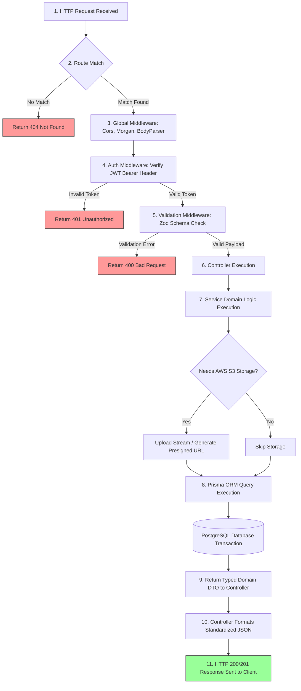

# Student Hub - Backend Architecture Specification

> **Status**: Active / Authoritative  
> **Document Version**: 2.0.0  
> **Last Updated**: 2026-07-29  
> **Owner**: Lead Architect & Backend Engineering Team  
> **Scope**: Express.js REST API Backend Service  

---

## Table of Contents
1. [Backend Overview](#1-backend-overview)
2. [Backend Folder Structure](#2-backend-folder-structure)
3. [Backend Request Lifecycle](#3-backend-request-lifecycle)
4. [Technology Stack](#4-technology-stack)
5. [Technology Alternatives](#5-technology-alternatives)
6. [Architecture Decision Records (ADR)](#6-architecture-decision-records-adr)
7. [Architecture Evolution](#7-architecture-evolution)
8. [Future Improvements](#8-future-improvements)
9. [Best Practices](#9-best-practices)
10. [Important Notes & Maintenance Protocol](#10-important-notes--maintenance-protocol)

---

## 1. Backend Overview

### 1.1 Why Student Hub Uses a Separate Backend

Historically, Student Hub originated as a full-stack Next.js application leveraging Next.js Route Handlers. As the platform's requirements expanded—requiring full-text search across academic resources, multipart file streaming to AWS S3, complex relational queries, and fine-grained background job processing—the monolithic Route Handler pattern presented several key limitations:

1. **Tight Coupling of SSR & API Workloads**: High API compute loads (e.g., PDF parsing, file uploading, password hashing) directly degraded Next.js Server-Side Rendering (SSR) responsiveness and cold-start performance.
2. **Deployment & Scaling Bottlenecks**: Scaling API capacity required redeploying the entire Next.js frontend bundle, preventing independent scaling of memory-intensive or CPU-heavy API routes.
3. **Multi-Client Ecosystem Readiness**: A standalone REST API enables future mobile applications (iOS, Android, React Native), browser extensions, and third-party integrations to consume the exact same backend endpoints without duplicating business logic.
4. **Security Boundary Enforcement**: Database connection strings, private AWS S3 credentials, and JWT secret keys are completely isolated from the web server runtime environment.
5. **Team Ownership & Developer Velocity**: Frontend developers can iterate on UI components, layouts, and client-side interactions in Next.js without needing to run database migrations or manage local backend services.

### 1.2 Responsibilities of the Backend

The Express.js backend serves as the single authority for data integrity, security, and storage orchestration for Student Hub. Its primary responsibilities include:

- **RESTful API Delivery**: Exposing standardized HTTP endpoints under `/api/v1/*` for resources, courses, programs, users, and authentication.
- **Authentication & Authorization**: Issuing, verifying, and validating stateless JSON Web Tokens (JWT) and enforcing Role-Based Access Control (RBAC).
- **Domain Business Logic**: Enforcing business validation (e.g., verifying course prerequisites, checking duplicate uploads, calculating resource metrics).
- **Data Persistence**: Interfacing with the PostgreSQL relational database through Prisma ORM using type-safe queries and ACID database transactions.
- **Cloud Object Storage Orchestration**: Handling file stream uploads via Multer and generating secure AWS S3 presigned URLs for resource downloads.
- **Input Sanitization & Schema Validation**: Intercepting every incoming request payload using Zod schemas before it reaches domain services.
- **Centralized Error Handling & Observability**: Catching runtime exceptions, formatting uniform JSON error responses, and logging requests via Morgan.

### 1.3 System Architectural Goals

```
┌─────────────────────────────────────────────────────────────────────────┐
│                        BACKEND CORE GOALS                               │
├─────────────────┬─────────────────┬──────────────────┬──────────────────┤
│ Maintainability │   Testability   │   Scalability    │ High Availability│
│ Clean layered   │ Pure services   │ Horizontal API   │ Connection pools │
│ architecture    │ mockable via    │ nodes behind     │ graceful retry   │
│ & strict DI     │ unit/integration│ load balancer    │ & zero downtime  │
└─────────────────┴─────────────────┴──────────────────┴──────────────────┘
```

### 1.4 Scalability Strategy

- **Stateless API Design**: The Express server retains zero session state in memory. Any instance of the API server can serve any incoming HTTP request.
- **Horizontal Scaling**: API nodes can be scaled horizontally across cloud containers (AWS EC2, ECS, or Render) behind an Application Load Balancer (ALB).
- **Database Connection Pooling**: Prisma Client uses built-in connection pooling to efficiently manage PostgreSQL connections under heavy concurrent loads.
- **Offloading Heavy Asset Traffic**: Large files (PDFs, notes, textbooks) bypass backend compute bandwidth by streaming directly to AWS S3, returning only S3 object keys and metadata to PostgreSQL.

---

## 2. Backend Folder Structure

The Express backend codebase strictly adheres to a **Layered Architecture**. Code is structured into dedicated, decoupled directories located under `backend/src/`.

```
backend/
├── prisma/
│   ├── schema.prisma             # Database schema, models, and relations
│   └── migrations/               # SQL migration files
├── src/
│   ├── config/                   # Environment variables & SDK initializations
│   ├── controllers/              # HTTP Request/Response orchestrators
│   ├── lib/                      # Singleton clients (Prisma, S3)
│   ├── middleware/               # Express middleware (Auth, Validation, Errors)
│   ├── routes/                   # Endpoint path declarations & route handlers
│   ├── services/                 # Pure domain business logic & use-cases
│   ├── types/                    # DTOs, TypeScript interfaces, Custom types
│   ├── utils/                    # Shared helper functions & custom AppError
│   ├── validators/               # Zod validation schemas
│   └── server.ts                 # Express app setup & server entrypoint
├── .env.example                  # Environment variable template
├── tsconfig.json                 # TypeScript compiler configuration
└── package.json                  # Backend dependencies & npm scripts
```

### Folder Deep-Dive

#### `src/config/`
- **Purpose**: Centralized application configuration and environment variable loading.
- **Responsibility**: Reading, parsing, and validating process environment variables (`process.env`) using `dotenv` and Zod schema validation.
- **Why It Exists**: Prevents `process.env` references from scattering across the codebase; guarantees application crash on startup if required variables (e.g., `DATABASE_URL`, `JWT_SECRET`, `AWS_BUCKET_NAME`) are missing.
- **What Should NOT Be Placed Here**: Business logic, database queries, or Express route declarations.

#### `src/routes/`
- **Purpose**: Declaration of REST API endpoints and HTTP method routing.
- **Responsibility**: Mapping URI paths (e.g., `/api/v1/resources`, `/api/v1/auth/login`) to middleware chains and specific controller functions.
- **Why It Exists**: Serves as the clear API manifest showing all available endpoints in one location.
- **What Should NOT Be Placed Here**: Database access logic, raw request parsing, or complex data processing.

#### `src/controllers/`
- **Purpose**: HTTP interface adapter layer.
- **Responsibility**: Extracting HTTP request parameters (`req.params`, `req.query`, `req.body`), passing extracted DTOs to business services, and formatting HTTP JSON responses (`res.status().json()`).
- **Why It Exists**: Decouples the HTTP layer from business logic so services can remain transport-agnostic.
- **What Should NOT Be Placed Here**: Direct database SQL/Prisma calls, raw password hashing, or complex business algorithms.

#### `src/services/`
- **Purpose**: Core business logic and domain execution layer.
- **Responsibility**: Executing business workflows (e.g., verifying user registration, computing user upload quotas, executing search logic, invoking AWS S3 SDK).
- **Why It Exists**: Represents the core application engine. Services can be invoked by HTTP controllers, background workers, or CLI scripts without modification.
- **What Should NOT Be Placed Here**: Direct references to Express `req` or `res` objects, HTTP status code formatting, or route declarations.

#### `src/middleware/`
- **Purpose**: Cross-cutting HTTP request interceptors.
- **Responsibility**: Processing requests before controllers run (e.g., `authenticateJWT`, `validateBody`, `multerUpload`, `rateLimiter`, `errorHandler`).
- **Why It Exists**: Eliminates duplicate authentication and validation checks across controllers.
- **What Should NOT Be Placed Here**: Domain-specific business logic or persistent database modifications.

#### `src/validators/`
- **Purpose**: Input schema definitions and runtime data contract enforcement.
- **Responsibility**: Defining Zod schemas for request parameters, headers, queries, and JSON request bodies.
- **Why It Exists**: Guarantees that only valid, type-safe data reaches the controllers and services.
- **What Should NOT Be Placed Here**: Async database checks, UI rendering logic, or response formatting.

#### `src/lib/`
- **Purpose**: Wrapper layer for third-party SDK clients and database connections.
- **Responsibility**: Instantiating singleton instances of PrismaClient, AWS S3 Client, and Redis client.
- **Why It Exists**: Prevents multiple redundant connections or re-initializations across requests.
- **What Should NOT Be Placed Here**: Request-specific state or user context.

#### `src/utils/`
- **Purpose**: Pure utility functions and custom error classes.
- **Responsibility**: Formatting strings, date manipulation, custom error definitions (`AppError`, `NotFoundError`, `UnauthorizedError`).
- **Why It Exists**: Promotes DRY (Don't Repeat Yourself) helper code across services and middleware.
- **What Should NOT Be Placed Here**: Domain business workflows or database access logic.

#### `src/types/`
- **Purpose**: Centralized TypeScript interface definitions and ambient type augmentations.
- **Responsibility**: Extending Express `Request` context (e.g., appending `req.user`), defining service input/output DTOs, and declaring system-wide enums.
- **Why It Exists**: Enforces compile-time type safety across all backend layers.
- **What Should NOT Be Placed Here**: Executable JavaScript code, functions, or variable initializations.

#### `prisma/`
- **Purpose**: Database modeling, migration management, and seed data.
- **Responsibility**: Maintaining `schema.prisma`, managing declarative SQL migrations, and seeding initial database records (e.g., academic courses, departments).
- **Why It Exists**: Single source of truth for the relational database schema.
- **What Should NOT Be Placed Here**: Runtime backend application code or Express controllers.

---

## 3. Backend Request Lifecycle

Every incoming HTTP request follows a strict, unidirectional pipeline through the backend layers:

```
┌────────┐     ┌─────────┐     ┌────────┐     ┌────────────┐     ┌────────────┐     ┌─────────┐     ┌────────┐     ┌────────────┐     ┌──────────┐
│ Client │ ──> │ Express │ ──> │ Route  │ ──> │ Middleware │ ──> │ Controller │ ──> │ Service │ ──> │ Prisma │ ──> │ PostgreSQL │ ──> │ Response │
└────────┘     └─────────┘     └────────┘     └────────────┘     └────────────┘     └─────────┘     └────────┘     └────────────┘     └──────────┘
```

### Detailed Layer Breakdown



### Detailed Request Sequence Diagram

```mermaid
sequenceDiagram
    autonumber
    actor Client
    participant Express as Express App
    participant Route as Resource Router
    participant AuthMW as Auth Middleware
    participant ZodMW as Validation Middleware
    participant Ctrl as Resource Controller
    participant Svc as Resource Service
    participant S3 as AWS S3 SDK
    participant Prisma as Prisma Client
    participant DB as PostgreSQL DB

    Client->>Express: POST /api/v1/resources (Header: Bearer JWT, Body: JSON)
    Express->>Route: Resolve path match
    Route->>AuthMW: authenticateJWT(req, res, next)
    AuthMW->>AuthMW: jwt.verify(token, secret)
    AuthMW-->>Route: req.user = payload; next()
    Route->>ZodMW: validateRequest(CreateResourceSchema)
    ZodMW->>ZodMW: schema.parse(req.body)
    ZodMW-->>Route: next()
    Route->>Ctrl: createResource(req, res, next)
    Ctrl->>Svc: addResource(req.body, req.user.id)
    alt Resource contains file upload
        Svc->>S3: PutObjectCommand(Bucket, Key, Body)
        S3-->>Svc: Upload Success & ETag
    end
    Svc->>Prisma: prisma.resource.create({ data })
    Prisma->>DB: INSERT INTO "Resource" (...) VALUES (...)
    DB-->>Prisma: SQL Record Created
    Prisma-->>Svc: Typed Resource Entity
    Svc-->>Ctrl: Resource DTO
    Ctrl-->>Client: HTTP 201 Created `{ success: true, data: resource }`
```

---

## 4. Technology Stack

| Technology | Purpose | Why Chosen | Alternatives | Reason Alternatives Were Not Selected |
|------------|---------|------------|--------------|----------------------------------------|
| **Node.js** | Server Runtime | Event-driven, non-blocking I/O model providing superior performance for asynchronous I/O operations (file streaming, DB queries). | Python (FastAPI), Go | Node.js allows single-language (TypeScript) across full stack, sharing type definitions easily. |
| **Express.js** | Web Framework | Industry-standard minimal web framework with immense ecosystem, mature middleware model, and zero vendor lock-in. | NestJS, Fastify, Koa | Express provides lightweight simplicity without NestJS's steep OOP overhead or Fastify's plugin complexity. |
| **TypeScript** | Language | Strongly typed JavaScript variant that catches bugs at compile time and enforces explicit data contracts across layers. | Plain JavaScript | JavaScript lacks compile-time type safety, leading to runtime undefined bugs in multi-developer projects. |
| **PostgreSQL** | Relational Database | Enterprise-grade SQL database supporting complex JOIN queries, ACID transactions, JSONB indexing, and full-text search. | MySQL, MongoDB, SQLite | PostgreSQL offers superior JSON support, full-text search capabilities, and robust data integrity over MySQL/MongoDB. |
| **Prisma** | ORM / Query Builder | Auto-generated type-safe database client with declarative schema definitions and seamless SQL migration workflows. | Drizzle, TypeORM, Sequelize | Prisma provides superior developer experience (DX), auto-generated types, and declarative schema migrations. |
| **JWT** (`jsonwebtoken`) | Auth Transport | Stateless token authentication standard enabling secure client-side token storage and fast, server-side signature verification. | Server Sessions, Cookies | Server sessions require stateful storage (Redis/DB) for session lookups on every single request. |
| **bcrypt** | Password Hashing | Battle-tested adaptive hashing algorithm utilizing salt rounds to protect user passwords against rainbow table attacks. | Argon2, Scrypt | `bcrypt` is universally supported, hardware-accelerated, and standard across enterprise Node.js applications. |
| **Zod** | Input Validation | Schema-first TypeScript validation library providing static type inference and runtime input sanitization. | Joi, express-validator | Zod seamlessly infers TypeScript types directly from validation schemas, eliminating duplicated interface code. |
| **Multer** | Multipart Form Parser | Node.js middleware for handling `multipart/form-data`, optimized for processing file uploads efficiently. | Formidable, Busboy | Multer integrates natively as Express middleware, offering memory buffer or disk storage options. |
| **AWS S3** | Cloud Object Storage | Highly available, durable cloud storage for hosting uploaded academic PDFs, notes, and documents at scale. | Cloudinary, Local Storage | S3 provides industry-leading cost efficiency, infinite scale, and presigned URL access controls. |
| **Morgan** | HTTP Request Logger | Automated HTTP request logging middleware for debugging request latency, status codes, and endpoint traffic patterns. | Winston, Bunyan | Morgan provides zero-configuration HTTP logging out-of-the-box for Express applications. |
| **dotenv** | Environment Manager | Zero-dependency module that loads variables from `.env` files into `process.env` during application startup. | Custom Config Parser | `dotenv` is the universal 12-factor application standard for environment variable management. |

---

## 5. Technology Alternatives

### 5.1 Backend Framework Comparison

```
 Express.js ─── [Chosen for Student Hub] (Lightweight, mature, universal ecosystem)
 ├── NestJS ───── Heavy Angular-like OOP ceremony; unnecessary abstraction for current scale
 ├── Fastify ──── High performance; smaller ecosystem, non-standard plugin encapsulation
 ├── Koa ──────── Minimal generator/async framework; requires writing custom middleware stack
 ├── Hono ─────── Tailored for Edge/Serverless; less standard for long-running Node servers
 └── Next API ── Monolithic coupling; SSR contention; cold starts; limited long-running jobs
```

- **Express.js (Chosen)**:
  - *Pros*: Battle-tested, universal ecosystem, minimal overhead, simple learning curve, easy to onboard new engineers.
  - *Cons*: Requires discipline to enforce folder structures and error handling rules.
  - *Suitability*: Ideal balance of flexibility, performance, and maintainability.
- **NestJS**:
  - *Pros*: Strong structural opinion, native dependency injection, enterprise-ready.
  - *Cons*: Heavy boilerplate, steep learning curve (decorators, modules, providers).
  - *Why Rejected*: Over-engineered for Student Hub's pragmatic scope.
- **Next.js Route Handlers**:
  - *Pros*: Integrated single repository.
  - *Cons*: Bundles API compute with UI rendering; poor fit for long streaming uploads and worker processes.
  - *Why Rejected*: The primary goal of this architectural evolution was to separate backend compute from Next.js SSR.

### 5.2 Database Comparison

- **PostgreSQL (Chosen)**:
  - *Pros*: Strict ACID compliance, powerful relational query engine, advanced indexing, native Full-Text Search, JSONB support for flexible metadata.
  - *Cons*: Requires resource allocation compared to file-based databases.
  - *Suitability*: Academic resources have rich relational links (Users ➔ Programs ➔ Courses ➔ Resources ➔ Reviews). PostgreSQL handles complex JOINs effortlessly.
- **MongoDB**:
  - *Pros*: Schema-less document flexibility.
  - *Cons*: Poor support for complex multi-table relational integrity; requires manual data normalization for deep relationships.
  - *Why Rejected*: Student Hub data is inherently relational, not unstructured document data.
- **SQLite**:
  - *Pros*: Zero-configuration, single-file database.
  - *Cons*: Lacks concurrent write scaling; unsuitable for multi-instance cloud deployments.
  - *Why Rejected*: Cannot scale horizontally across web instances.

### 5.3 ORM Comparison

- **Prisma (Chosen)**:
  - *Pros*: Single declarative `schema.prisma` file, automatically generated TypeScript types that sync with database schema, seamless migration CLI (`prisma migrate`).
  - *Cons*: Slightly higher engine memory footprint due to Rust query engine binary.
  - *Why Selected*: Provides unmatched developer experience and compile-time type safety.
- **Drizzle ORM**:
  - *Pros*: Extremely lightweight, near-raw SQL performance, zero binary overhead.
  - *Cons*: Smaller ecosystem, requires writing manual SQL schema migration scripts in early phases.
  - *Why Not Chosen*: Prisma's schema migration DX is currently preferred for rapid feature evolution.
- **Sequelize / TypeORM**:
  - *Pros*: Legacy industry presence.
  - *Cons*: Verbose class-validator decorators, historical issues with complex TypeScript migration types.

### 5.4 Authentication Strategy Comparison

- **JWT + bcrypt (Chosen)**:
  - *Pros*: Complete statelessness; zero database lookup needed for token signature verification on protected routes; cross-domain mobile app compatible.
  - *Cons*: Token revocation requires implementing a Redis blacklist for invalidated tokens.
  - *Why Selected*: Fits the stateless Express architecture perfectly.
- **Session-Based Auth (Express-Session + Redis)**:
  - *Pros*: Easy server-side revocation.
  - *Cons*: Requires stateful storage infrastructure (Redis cluster) and cookie handling across cross-origin domains.
- **Third-Party Auth (Clerk / Auth.js / Firebase)**:
  - *Pros*: Turnkey login UI and social providers.
  - *Cons*: Vendor lock-in, recurring SaaS cost at scale, external network dependency.
  - *Future Roadmap Note*: OAuth (Google / GitHub) will be integrated directly into our custom JWT service in Phase 2 using official OAuth2 SDKs.

### 5.5 Cloud Storage Comparison

- **AWS S3 (Chosen)**:
  - *Pros*: Industry standard object storage, 99.999999999% (11 9s) durability, cost-effective storage tiers, presigned URL support for direct client uploads/downloads.
  - *Cons*: Requires IAM policy setup.
  - *Why Selected*: Standard for scalable document and asset management.
- **Cloudinary**:
  - *Pros*: Automatic image manipulation and transformations.
  - *Cons*: Very expensive for high-volume document/PDF storage.
  - *Why Rejected*: Student Hub primarily stores academic PDFs, ZIPs, and documents, not dynamic web imagery.

### 5.6 Validation Library Comparison

- **Zod (Chosen)**: Native TypeScript-first schema validation with type inference.
- **Joi**: Powerful validation but requires separate TypeScript interface declarations, causing maintenance drift.
- **express-validator**: Tied directly to Express request objects, making validators non-reusable in background jobs or services.

---

## 6. Architecture Decision Records (ADR)

### ADR-001: Decoupling Backend into Standalone Express.js Service
- **Status**: Accepted
- **Context**: Student Hub backend was previously implemented using Next.js App Router Route Handlers within a single repository.
- **Problem**: Next.js Route Handlers coupled API execution with frontend SSR page delivery, causing server cold starts and preventing independent API horizontal scaling.
- **Chosen Solution**: Extract all API endpoints, database operations, and storage operations into an independent Express.js + TypeScript application.
- **Why Chosen**: Allows independent deployment, improves API throughput, enables future mobile app client integration, and enforces clear separation of concerns.
- **Trade-offs**: Requires managing CORS configuration, dual deployment pipelines, and environment configuration across two repositories/folders.
- **Future Implications**: Backend can be containerized with Docker and deployed to any container orchestration service (AWS ECS, Kubernetes, Render).
- **Expected Scalability**: High. Allows API servers to scale horizontally from 1 to 100+ instances without impacting web frontend rendering.

### ADR-002: PostgreSQL as Relational Storage Engine
- **Status**: Accepted
- **Context**: Need a durable, relational database capable of handling complex academic relationships (Users, Programs, Courses, Resources, Ratings, Categories).
- **Problem**: Academic catalog data is highly relational; orphaned or inconsistent records ruin user trust.
- **Chosen Solution**: Adopt PostgreSQL as the core relational database.
- **Why Chosen**: Offers strong ACID guarantees, full-text search capability for resource titles/descriptions, and JSONB fields for flexible resource metadata.
- **Alternatives Considered**: MongoDB, MySQL, SQLite.
- **Trade-offs**: Requires managing database schema migrations explicitly via Prisma.
- **Expected Scalability**: High. Read replicas and connection poolers (PgBouncer) allow scaling to millions of reads.

### ADR-003: Prisma ORM for Database Access
- **Status**: Accepted
- **Context**: Need a type-safe data access layer to interact with PostgreSQL from TypeScript.
- **Chosen Solution**: Integrate Prisma ORM as the single database client.
- **Why Chosen**: Declarative `schema.prisma`, automatic generation of TypeScript interfaces, and built-in SQL migration management.
- **Trade-offs**: Prisma binary adds a minor initialization memory footprint.
- **Future Implications**: Any schema change in `schema.prisma` automatically updates compile-time types across all backend services.

### ADR-004: Stateless JWT & bcrypt Authentication Architecture
- **Status**: Accepted
- **Context**: Authenticating users across web and future mobile clients without maintaining server-side session state.
- **Chosen Solution**: Issue signed JWT bearer tokens upon successful credential verification using `bcrypt.compare()`.
- **Why Chosen**: Completely stateless, scalable across load-balanced API servers, and native to REST APIs (`Authorization: Bearer <token>`).
- **Trade-offs**: Token invalidation requires a Redis blacklist mechanism in future phases.

### ADR-005: AWS S3 Object Storage for Document Storage
- **Status**: Accepted
- **Context**: Academic resources (PDFs, docs, notes) require scalable binary storage.
- **Chosen Solution**: Offload all raw file assets to AWS S3 using `@aws-sdk/client-s3`.
- **Why Chosen**: Infinite scale, low cost, high durability, and support for secure presigned URLs.
- **Trade-offs**: Requires managing AWS IAM access keys and S3 CORS policies.

### ADR-006: Zod Schema-First Runtime Input Validation
- **Status**: Accepted
- **Context**: Malformed incoming HTTP requests can crash services or inject corrupt data into PostgreSQL.
- **Chosen Solution**: Implement Zod validation middleware (`validateBody`, `validateQuery`, `validateParams`) on all Express routes.
- **Why Chosen**: Automatically infers TypeScript types from runtime schemas, ensuring 100% sync between runtime validation and compile-time types.

---

## 7. Architecture Evolution

```
┌─────────────────────────────────────────────────────────────────────────────┐
│                       ARCHITECTURE EVOLUTION TIMELINE                       │
├──────────────┬────────────────────────┬─────────────────────────┬───────────┤
│ Date         │ Old Architecture       │ New Architecture        │ Trigger   │
├──────────────┼────────────────────────┼─────────────────────────┼───────────┤
│ 2026-07-29   │ Monolithic Next.js     │ Decoupled Express.js    │ System    │
│              │ Route Handlers         │ REST API Service        │ Redesign  │
├──────────────┼────────────────────────┼─────────────────────────┼───────────┤
│ 2026-07-29   │ Inline Mock Storage    │ AWS S3 Object Storage   │ Scalability│
│              │ & Local File System    │ via AWS SDK & Presigned │ Requirement│
├──────────────┼────────────────────────┼─────────────────────────┼───────────┤
│ 2026-07-29   │ Hardcoded Mock Auth    │ Stateless JWT & bcrypt   │ Security  │
│              │ Headers                │ Password Hashing        │ Requirement│
└──────────────┴────────────────────────┴─────────────────────────┴───────────┘
```

### Record 1: Migration from Next.js Route Handlers to Standalone Express.js Backend

- **Date**: 2026-07-29
- **Old Architecture**: Next.js App Router Route Handlers (`src/app/api/.../route.ts`).
- **New Architecture**: Standalone Express.js application with TypeScript, running independently on Node.js.
- **Reason**: Wanted complete architectural decoupling, independent deployment pipelines, elimination of SSR compute degradation, and unified REST API support for future mobile clients.
- **Benefits**:
  - Zero compute resource contention between Next.js SSR and API data processing.
  - API servers can be scaled independently on container platforms.
  - Standardized layered architecture (`routes` ➔ `controllers` ➔ `services` ➔ `prisma`).
- **Possible Drawbacks**: Requires cross-origin resource sharing (CORS) management and running two development servers locally (`npm run dev` in frontend, `npm run dev` in backend).
- **Frontend Impact**: Frontend components no longer call internal Next.js `/api/*` routes; they consume `process.env.NEXT_PUBLIC_API_URL/api/v1/*` via a shared API client wrapper.

---

## 8. Future Improvements

The following architectural components are planned for future evolutionary phases. Components must be integrated according to the blueprints below:

```
                  ┌──────────────────────────────────────────────┐
                  │          FUTURE INFRASTRUCTURE MAP           │
                  └──────────────────────┬───────────────────────┘
                                         │
     ┌──────────────────┬────────────────┼──────────────────┬──────────────────┐
     ▼                  ▼                ▼                  ▼                  ▼
┌─────────┐       ┌───────────┐    ┌───────────┐      ┌───────────┐      ┌───────────┐
│  Redis  │       │  Docker   │    │  BullMQ   │      │Prometheus │      │ WebSockets│
│ Cache & │       │ Container │    │ Asynchronous│    │ & Grafana │      │ Real-time │
│ Blacklist       │ & CI/CD   │    │ Job Queue │      │ Monitoring│      │ Sync      │
└─────────┘       └───────────┘    └───────────┘      └───────────┘      └───────────┘
```

1. **Redis Caching & Token Blacklisting**:
   - *Placement*: `src/lib/redis.ts` & `src/middleware/auth.middleware.ts`.
   - *Role*: Cache frequent SQL queries (e.g., popular courses, program lists) and hold invalidated JWT tokens upon user logout.
2. **Docker Containerization & CI/CD**:
   - *Placement*: `backend/Dockerfile`, `.dockerignore`, `.github/workflows/deploy-backend.yml`.
   - *Role*: Package backend into lightweight Alpine Linux containers for automated deployment via GitHub Actions.
3. **Automated Testing Suite (Jest & Supertest)**:
   - *Placement*: `backend/tests/unit/` & `backend/tests/integration/`.
   - *Role*: Provide full test coverage for domain services (`services/*.test.ts`) and end-to-end HTTP endpoint testing (`routes/*.test.ts`).
4. **Asynchronous Task Queues (BullMQ + Redis)**:
   - *Placement*: `src/queues/` & `src/workers/`.
   - *Role*: Handle CPU-intensive asynchronous tasks such as PDF text extraction, OCR indexing, thumbnail generation, and email notifications.
5. **Rate Limiting Middleware (`express-rate-limit`)**:
   - *Placement*: `src/middleware/rateLimiter.middleware.ts`.
   - *Role*: Protect public endpoints (`/api/v1/auth/*`, `/api/v1/resources/upload`) from brute-force attacks and abuse.
6. **Observability & APM (Prometheus, Grafana, Sentry)**:
   - *Placement*: `src/config/telemetry.ts` & `src/utils/logger.ts`.
   - *Role*: Capture unhandled exceptions, track API request latency histograms, and alert on elevated HTTP 5xx error rates.
7. **Microservice Splitting (Search & Document Processing)**:
   - *Placement*: Independent service repository `student-hub-search-service`.
   - *Role*: If full-text search demands outgrow PostgreSQL capacity, extract search indexing to a dedicated Elasticsearch / Meilisearch microservice.
8. **Real-time WebSockets (Socket.io)**:
   - *Placement*: `src/websocket/`.
   - *Role*: Power real-time collaborative study sessions and live notification badges.

---

## 9. Best Practices

### 9.1 Coding & Naming Conventions

- **File Naming**: Use camelCase for utilities, kebab-case or descriptive dot notation for modules (e.g., `user.controller.ts`, `auth.service.ts`, `resource.validator.ts`).
- **Class & Interface Naming**: Use PascalCase (e.g., `UserService`, `AppError`, `CreateResourceDTO`).
- **Variable & Function Naming**: Use camelCase with clear verb prefixes (e.g., `getUserById`, `calculateUploadQuota`, `isTokenExpired`).

### 9.2 Layer Dependency Flow Rules

```
Routes ──> Middleware ──> Controllers ──> Services ──> Prisma / AWS S3
```

- **Rule 1**: Dependencies MUST ONLY flow downward. A service must NEVER import a controller or route handler.
- **Rule 2**: Controllers MUST NEVER make direct database calls via Prisma. Database logic belongs exclusively in Services.
- **Rule 3**: Services MUST NEVER inspect HTTP request headers or write directly to HTTP response objects. Transport concerns belong exclusively in Controllers and Middleware.

### 9.3 Error Handling Architecture

All operational errors must inherit from a centralized `AppError` base class:

```typescript
// Standard Error Response Contract
{
  "success": false,
  "error": {
    "code": "RESOURCE_NOT_FOUND",
    "message": "The requested academic resource does not exist.",
    "details": null
  }
}
```

- Operational errors (`NotFoundError`, `UnauthorizedError`, `ValidationError`) specify explicit HTTP status codes (400, 401, 403, 404).
- Unhandled runtime exceptions are intercepted by `errorHandler.middleware.ts`, logged to monitoring tools, and masked as HTTP 500 Internal Server Error in production.

### 9.4 API Design Rules

- **Standard Endpoint Base**: All routes must be prefixed under `/api/v1/`.
- **Nouns over Verbs**: Use RESTful resource URIs (`GET /api/v1/resources`, `POST /api/v1/resources`, `DELETE /api/v1/resources/:id`).
- **Standardized Response Wrapper**:
  ```json
  {
    "success": true,
    "data": { ... },
    "meta": { "page": 1, "limit": 20, "total": 150 }
  }
  ```

---

## 10. Important Notes & Maintenance Protocol

> [!IMPORTANT]
> **Living Technical Specification Governance Protocol**

This document is the **authoritative single source of truth** for the Student Hub backend architecture. Whenever the backend architecture evolves or technical decisions are altered in the future, developers and architects **MUST** update this document.

### Mandatory Steps for Any Future Architecture Modification

Whenever a backend modification occurs (e.g., adding Redis, switching ORMs, adding microservices, changing auth strategy), the developer/architect MUST record:

1. **What Changed**: Concise description of the modification.
2. **Why It Changed**: Technical or business justification.
3. **Affected Files & Modules**: Detailed list of modified routes, services, or configurations.
4. **Benefits Gained**: Measured performance, security, or DX improvements.
5. **Drawbacks & Risks**: Technical debt or operational costs introduced.
6. **Alternative Approaches Evaluated**: What options were considered and rejected.
7. **Why Alternatives Were Rejected**: Objective technical reasons.
8. **Frontend Architectural Impact**: Any required changes to frontend API contracts.
9. **Migration Steps**: Sequential instructions for applying database or config migrations.
10. **Breaking Changes**: Explicit warning of any broken backward compatibility.

### Handling Historical Architecture Decisions

- **NEVER DELETE** previous architectural decisions or historical ADRs from this document.
- Instead, update the status tag of outdated decisions to:
  - `[Deprecated]` — Marked for removal in an upcoming release.
  - `[Replaced]` — Replaced by a newer ADR (must include link to replacing ADR).
  - `[Superseded]` — Overridden by a fundamental architectural shift.
- Provide a clear explanation of why the decision was changed and what replaced it.

*This specification ensures that any new backend engineer can read this document, understand the complete request lifecycle, comprehend every technical decision, and immediately write compliant code.*
