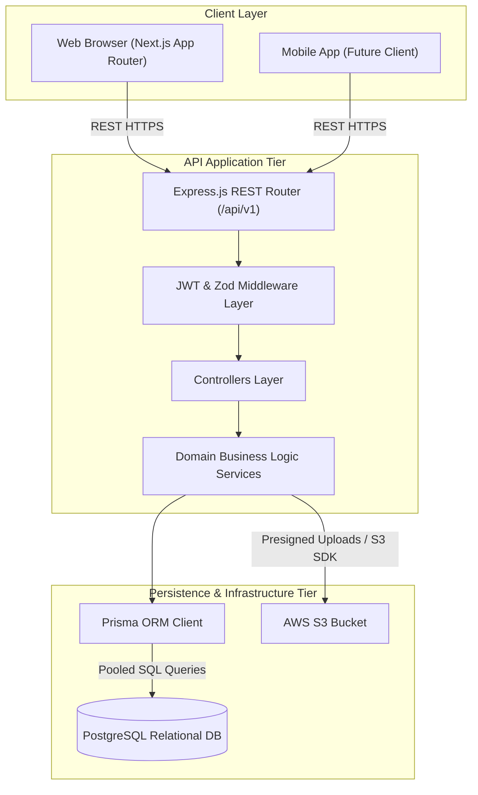

# Engineering Case Study: Building & Scaling Student Hub

> **Document Status**: Authoritative Engineering Case Study  
> **Author**: Principal Software Architect & Core Engineering Team  
> **System Architecture**: Decoupled Next.js Frontend + Express.js REST API Backend  
> **Target Audience**: Staff/Principal Engineers, Engineering Leadership, Technical Recruiters  
> **Last Updated**: 2026-07-29  

---

## Executive Summary

**Student Hub** is an academic resource discovery and exchange platform engineered to solve the fragmented distribution of university study materials, past examination papers, lecture notes, and course syllabi. 

This case study documents the architectural transformation of Student Hub from an early full-stack Next.js monolith using inline Route Handlers into a production-grade, decoupled multi-tier architecture featuring a **Next.js App Router (Feature-Sliced Design)** web frontend, an independent **Express.js + TypeScript** REST API backend, a **PostgreSQL** relational database managed via **Prisma ORM**, and cloud asset storage powered by **AWS S3**.

---

## 1. Problem Statement & Research

### 1.1 The Academic Resource Fragmentation Problem
In higher education environments, academic materials are routinely scattered across disparate platforms: learning management systems (Canvas, Blackboard), Google Drive links, Discord servers, and local student laptops. As a consequence:
- Students spend hours searching for reliable past exam papers and verified lecture notes.
- Course resources lack standardized metadata (course codes, departments, academic terms).
- Materials frequently disappear when graduating students delete shared cloud drives.

### 1.2 System Requirements
To solve this problem, Student Hub required a technical solution capable of:
1. Providing sub-second full-text search across thousands of course materials.
2. Handling large binary file uploads (PDFs, ZIPs up to 50MB) with high durability.
3. Guaranteeing strict data integrity across complex academic relationships (Programs ➔ Courses ➔ Resources ➔ Ratings).
4. Supporting a stateless REST API model ready to serve web, mobile, and third-party consumers.

---

## 2. The Architecture Journey & Technical Evolution

### 2.1 Phase 1 Monolith: The Next.js Route Handler Bottleneck
Initial iterations of Student Hub were built as a full-stack Next.js application where API endpoints were co-located inside Next.js App Router Route Handlers (`src/app/api/.../route.ts`). While fast to prototype, this monolithic coupling created critical engineering bottlenecks:

- **Compute Resource Contention**: CPU-heavy operations like `bcrypt` password hashing and multipart file stream parsing shared event loop threads with Next.js Server-Side Rendering (SSR) page generation.
- **Cold Start Latency**: Serverless/Edge API executions suffered from cold-start overhead when loading heavy SDK binaries (`prisma`, `@aws-sdk/client-s3`).
- **Deployment Coupling**: Bug fixes in API validation required redeploying the entire web frontend bundle.

### 2.2 Phase 2 Evolution: Decoupling into Standalone Express REST API
To overcome these limitations, we undertook a systematic architectural migration, extracting all API logic, data validation, database mapping, and cloud storage operations into an independent **Express.js + TypeScript** backend.

---

## 3. Technology Selection & Comparative Analysis

The engineering team conducted exhaustive trade-off analyses before selecting every major component in the stack:

### 3.1 Backend Framework: Express.js vs. Alternatives
- **Why Express.js Was Selected**: Express provided the ideal balance of lightweight simplicity, minimal memory overhead, zero vendor lock-in, and instant onboarding velocity for new engineers.
- **Alternatives Evaluated**:
  - *Next.js Route Handlers*: Rejected due to SSR resource contention and deployment coupling.
  - *NestJS*: Evaluated but rejected due to excessive class-decorator boilerplate for our current team scale.
  - *Fastify*: Recognized for fast serialization, but Express was selected for its superior ecosystem maturity.

### 3.2 Database Engine: PostgreSQL vs. MongoDB
- **Why PostgreSQL Was Selected**: Academic catalog data is inherently relational. PostgreSQL's strict ACID guarantees, foreign key constraints, JSONB column capabilities, and native Full-Text Search (FTS) indexing made it vastly superior to document stores.
- **Why MongoDB Was Rejected**: Lacked enforced relational integrity, requiring fragile manual data normalization for deep relationships (e.g., verifying program and course bounds during resource upload).

### 3.3 Data Access Layer: Prisma ORM vs. Raw SQL / TypeORM
- **Why Prisma Was Selected**: Prisma's single declarative `schema.prisma`, automatically generated compile-time TypeScript types, and automated SQL migration workflows drastically reduced data access bugs.

---

## 4. Key Engineering Challenges, Failures & Lessons Learned

### 4.1 Challenge: File Stream Memory Exhaustion
- **Issue**: Early upload implementations buffered incoming file payloads directly in Node server RAM before uploading to AWS S3. Under concurrent multi-user uploads, memory consumption spiked to 100%, causing Out-Of-Memory (OOM) container crashes.
- **Resolution**: Replaced in-memory buffer storage with Multer file stream parsing and integrated **AWS S3 Presigned URLs**, allowing large file uploads to stream directly from client browsers to S3, bypassing API compute bandwidth entirely.

### 4.2 Challenge: Cross-Origin Resource Sharing (CORS) Security
- **Issue**: Decoupling the frontend (`studenthub.app`) and backend (`api.studenthub.app`) introduced CORS browser preflight check failures (`OPTIONS 403`).
- **Resolution**: Implemented strict, explicit CORS middleware configurations allowing credentials while restricting allowed origin domains dynamically via environment variables.

---

## 5. Security, Performance & Scalability Architecture

1. **Stateless JWT Security**: The backend maintains zero session state in memory. Signature verification occurs statelessly on API nodes using signed JWT bearer tokens.
2. **Password Security**: Passwords are never stored in plain text. Hashing is performed using `bcrypt` with 10 salt rounds.
3. **Horizontal API Scaling**: Because the Express backend is 100% stateless, API nodes scale horizontally across cloud containers (AWS EC2 / Render) behind an Application Load Balancer.
4. **Database Connection Pooling**: Prisma Client uses built-in connection pooling (supplemented by PgBouncer in production) to prevent database connection exhaustion during peak traffic.

---

## 6. Interview Talking Points (Architectural Q&A)

If discussing this project in a Staff/Principal Software Architect interview, highlight the following technical decisions:

- **Q: Why did you separate the Next.js frontend from the Express backend?**  
  *Answer*: "We separated them to eliminate resource contention between Next.js SSR page rendering and CPU-heavy API operations like bcrypt hashing and file streaming. It also decoupled our deployment pipelines, eliminated cold starts, and established a clean REST API consumable by future mobile applications."

- **Q: How do you enforce clean code architecture in the frontend?**  
  *Answer*: "We adopted Feature-Sliced Design (FSD), categorizing code into `app`, `widgets`, `features`, `entities`, `shared`. We enforce unidirectional import rules via ESLint to prevent circular dependencies and god-files."

- **Q: How do you handle file uploads at scale?**  
  *Answer*: "We offload binary storage to AWS S3 using presigned URLs and stream parsing, ensuring large files never saturate backend API RAM or block Node's asynchronous event loop."

- **Q: How do you handle database migrations safely in production?**  
  *Answer*: "We adhere to the Expand and Contract pattern for zero-downtime schema updates, managing migrations via Prisma Migrate (`prisma migrate deploy`) inside automated CI/CD pipelines."

---

## Document Cross-References

- **[../architecture/architecture.md](../architecture/architecture.md)** — Overall system architecture
- **[../decisions/architecture-decisions.md](../decisions/architecture-decisions.md)** — Architectural Decision Records
- **[../decisions/tech-stack.md](../decisions/tech-stack.md)** — Comprehensive tech stack evaluation matrix
