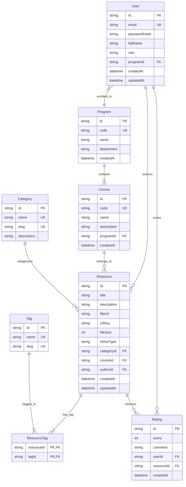

# Entity Relationship Diagram (ERD) - Student Hub

> **Document Status**: Active / Authoritative  
> **Database**: PostgreSQL 16+  
> **ORM Engine**: Prisma ORM  
> **Last Updated**: 2026-07-29  

---

## 1. Complete System ERD Diagram

The following Mermaid diagram defines the complete relational model for Student Hub:

---

## 2. Table Cardinality Summary

- **`User` to `Program`**: Many-to-One (`User.programId` -> `Program.id`). Multiple students enroll in a single academic program.
- **`Program` to `Course`**: One-to-Many (`Course.programId` -> `Program.id`). A program contains multiple required and elective courses.
- **`Course` to `Resource`**: One-to-Many (`Resource.courseId` -> `Course.id`). A course houses multiple academic study materials.
- **`User` to `Resource`**: One-to-Many (`Resource.authorId` -> `User.id`). A student uploads multiple academic resources.
- **`Resource` to `Tag`**: Many-to-Many via join table `ResourceTag` (`resourceId`, `tagId`).
- **`Resource` to `Rating`**: One-to-Many (`Rating.resourceId` -> `Resource.id`).

---

## Document Cross-References

- **[schema.md](./schema.md)** — Detailed schema field data dictionary
- **[migrations.md](./migrations.md)** — Database migration workflow
- **[../architecture/database-architecture.md](../architecture/database-architecture.md)** — High-level database architecture
