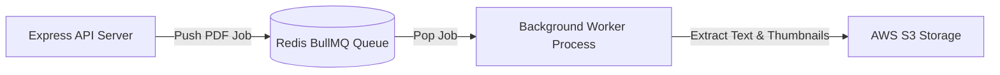

# Architectural Integration Blueprints for Future Improvements - Student Hub

> **Document Status**: Draft / Architectural Integration Blueprints  
> **Scope**: Structural Placement for Redis, Docker, CI/CD, Queues, Monitoring, Microservices & WebSockets  
> **Last Updated**: 2026-07-29  

---

## 1. Overview

This document provides explicit architectural placement and integration blueprints for future technology components. These components are reserved in the system design but are NOT yet active in code.

---

## 2. Component Integration Blueprints

### 2.1 Redis (Cache & Token Blacklist)
- **Target File Location**: `backend/src/lib/redis.ts` & `backend/src/middleware/rateLimiter.middleware.ts`
- **Architectural Role**:
  1. *Response Caching*: Cache high-frequency SQL queries (`GET /api/v1/resources`) with a 5-minute TTL.
  2. *Token Blacklisting*: Store invalidated JWT tokens upon user logout (`POST /api/v1/auth/logout`) until token expiration.

### 2.2 Docker & Containerization
- **Target File Location**: `backend/Dockerfile`, `.dockerignore`, `docker-compose.yml`
- **Architectural Role**: Package the Express backend and PostgreSQL database into lightweight Alpine Linux containers to guarantee identical environment execution locally and in production.

### 2.3 Automated CI/CD Pipelines
- **Target File Location**: `.github/workflows/ci-cd.yml`
- **Architectural Role**: Automated GitHub Actions pipeline that runs ESLint, type-checking (`tsc`), Supertest integration suites, and triggers automatic deployments to Vercel (Frontend) and Render (Backend).

### 2.4 Asynchronous Worker Queues (BullMQ + Redis)
- **Target File Location**: `backend/src/queues/` & `backend/src/workers/`
- **Architectural Role**: Offload background jobs (PDF thumbnail generation, text OCR indexing, email notifications) from the main Express HTTP thread.

### 2.5 Rate Limiting Middleware (`express-rate-limit`)
- **Target File Location**: `backend/src/middleware/rateLimiter.middleware.ts`
- **Architectural Role**: Protect public endpoints (`/api/v1/auth/login`, `/api/v1/resources`) from brute-force attacks by restricting clients to 100 requests per 15-minute window.

### 2.6 Observability & Error Monitoring (Sentry & Prometheus)
- **Target File Location**: `backend/src/config/telemetry.ts` & `backend/src/utils/logger.ts`
- **Architectural Role**: Capture unhandled backend runtime exceptions, send alerts to Sentry, and export Prometheus HTTP latency metrics for Grafana dashboards.

### 2.7 Microservices Decomposition
- **Target File Location**: `services/search-service/`
- **Architectural Role**: If full-text search query volume exceeds PostgreSQL capacity, extract search operations to a dedicated Elasticsearch or Meilisearch microservice.

### 2.8 WebSockets (Socket.io)
- **Target File Location**: `backend/src/websocket/`
- **Architectural Role**: Power real-time collaborative study sessions, live presence indicators, and instant document upload notification badges.

---

## Document Cross-References

- **[roadmap.md](./roadmap.md)** — Project phase roadmap
- **[../architecture/backend-architecture.md](../architecture/backend-architecture.md)** — Express backend architecture
